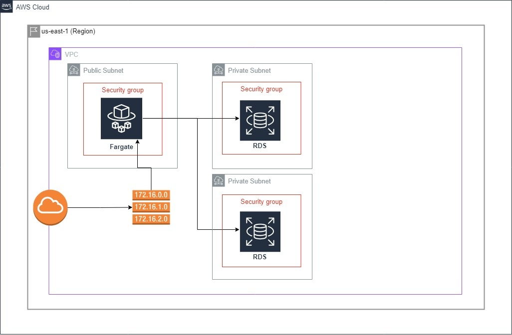
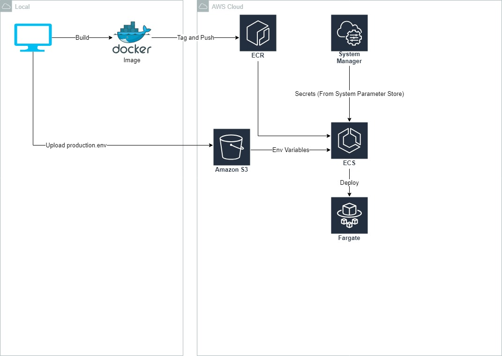

# AWS

Figure 1: AWS Architecture

The Sabai backend is implemented with the Django Rest Framework(DRF), with PostgreSQL powering the database. Figure 1 above shows the Sabai webserver setup, where the Fargate instance will be the main host of the webserver. AWS requires RDS instances to be deployed across 2 availability zones for redundancy reasons. However, this would be done when the first instance is setup (i.e AWS handles the duplicate deployment)

Considerations:
1. Fargate was used instead of EC2 due to its ease of use. Since it runs on a serverless model, the time to deployment would be reduced, as there is no need to configure an EC2 instance every deployment.
2. To reduce costs, service would be deployed on an elastic ip address. Since the service would only be running during the clinics (2 weeks period), there is no currently foreseeable need to deploy to a reserved domain.

Figure 2: Image deployment flow

The backend will be deployed using docker to allow us to quickly deploy the backend onto the cloud. Currently, a manual deployment flow is used. The steps are as follows:

1. Build, tag and push the image to ECR through the command line on the local machine. 
2. Afterwards, as per AWS best practice 
    - Upload the secrets onto System Parameter Store (In AWS System Manager)
    - Upload env file onto the S3 bucket. The file must be uploaded with the following name: `production.env` . Do not include secrets in this file. Secrets include login credentials, secret keys and db passwords
3. Create (or update) the task definition in ECS. A task definition contains task parameters such as the image link from ECR, env files, env variables and various other instance setup settings.
4. Once ready to deploy, create a service using the task definition defined previously. If all goes well, the server will be up in less than 5 minutes.